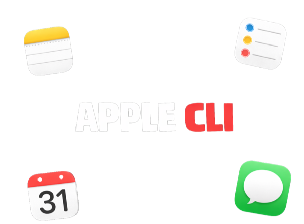

# apple-cli



> **Disclaimer:** This is not an official Apple project. Not affiliated with or endorsed by Apple Inc. Apple, macOS, iMessage, Notes, Reminders, and Calendar are trademarks of Apple Inc.

Apple CLI for macOS. Local-first automation for **Notes**, **Reminders**, **Calendar**, and **Messages** using AppleScript behind a stable CLI surface. Runs entirely on device.

---

## Table of Contents

- [Installation](#installation)
- [Permissions](#permissions)
- [Repository Structure](#repository-structure)
- [Commands Reference](#commands-reference)
  - **Commands:** [notes](#notes) | [reminders](#reminders) | [calendar](#calendar) | [messages](#messages)
- [Testing Status](#testing-status)
- [Requirements](#requirements)
- [License](#license)

---

## Installation

### From source

```bash
git clone <your-repo-url>
cd apple-cli
cargo build --release
sudo cp target/release/apple /usr/local/bin/
```

### Local install (no sudo)

```bash
cargo install --path .
```

---

## Permissions

This CLI uses AppleScript. macOS will prompt for **Automation** permissions the first time you call each app.

Required permissions:
- **Notes**
- **Reminders**
- **Calendar**
- **Messages**

If a command fails with `-10827` or `AppleEvent handler failed`, enable permissions here:
**System Settings → Privacy & Security → Automation → allow your terminal/app/binary**.

---

## Repository Structure

```text
apple-cli/
├── Cargo.toml
├── Cargo.lock
├── README.md
├── assets/
│   └── apple-cli-banner.png
└── src/
    ├── main.rs
    ├── common.rs
    ├── notes.rs
    ├── reminders.rs
    ├── calendar.rs
    └── messages.rs
```

---

## Commands Reference

### notes

```bash
apple notes accounts list
apple notes folders list|create|delete
apple notes list|get|create|update|delete|move|search|show
apple notes attachments list|save|delete
```

Examples:
```bash
apple notes create --folder "Notes" --name "Test" --body "<p>Hello</p>"
apple notes update <note_id> --body "<p>Updated</p>" --attach /path/file.pdf
apple notes attachments list <note_id>
```

Notes limitations:
- Attachment **delete** is best-effort; some builds return `AppleEvent handler failed`. Deleting the note removes attachments reliably.
- Some Notes UI features (tables/checklists/voice notes) are not scriptable.

---

### reminders

```bash
apple reminders lists
apple reminders lists-create|lists-update|lists-delete
apple reminders list|get|create|update|complete|delete
```

Examples:
```bash
apple reminders create --list "Reminders" --title "Pay rent" --due "2026-03-14" --flagged true
apple reminders update <id> --remind-me "2026-03-13 18:00:00"
```

Supported fields:
- due date, all-day due date, remind-me date, priority, flagged, completed

---

### calendar

```bash
apple calendar calendars
apple calendar calendars-create|calendars-delete
apple calendar events|get|create|update|delete|show
apple calendar alarms list|add|delete
apple calendar attendees list|add
```

Examples:
```bash
apple calendar create --calendar "Work" --title "Standup" --start "2026-03-13 10:00:00" --end "2026-03-13 10:30:00"
apple calendar update <event_id> --recurrence "RRULE:FREQ=DAILY;COUNT=2"
apple calendar alarms add <event_id> --type display --minutes=-15
```

Calendar limitations:
- Alarm **delete** can fail with `AppleEvent handler failed` on some macOS builds. Workaround: delete the event.
- Status updates are best-effort; if Calendar rejects the status, the command still succeeds for other fields.

---

### messages

```bash
apple messages services
apple messages chats [--type imessage|sms|rcs]
apple messages chat-participants --id <chat_id>
apple messages buddies --type imessage
apple messages send --to <handle> --text "Hello"
apple messages send-chat --id <chat_id> --text "Hello"
```

Messages limitations:
- No transcript/history, read receipts, typing indicators, stickers, or voice notes (not in AppleScript dictionary).

---

## Testing Status (2026-03-13)

**Notes**
- Passed: create/get/update/search/move/delete; attachments create/list/save
- Known issue: attachments delete can fail with `AppleEvent handler failed`

**Reminders**
- Passed: lists CRUD, reminder CRUD, all fields (due/allday/remind/flagged/priority)

**Calendar**
- Passed: calendars list/create/delete; events CRUD; recurrence update; alarms add/list; attendees add/list
- Known issues: alarm delete can fail; status set is best-effort

**Messages**
- Passed: services, chats, chat participants, buddies
- Not tested: send (requires explicit recipient)

---

## Requirements

- macOS with Notes/Reminders/Calendar/Messages apps
- Rust (stable) for build
- Automation permissions for each target app

---

## License

MIT
